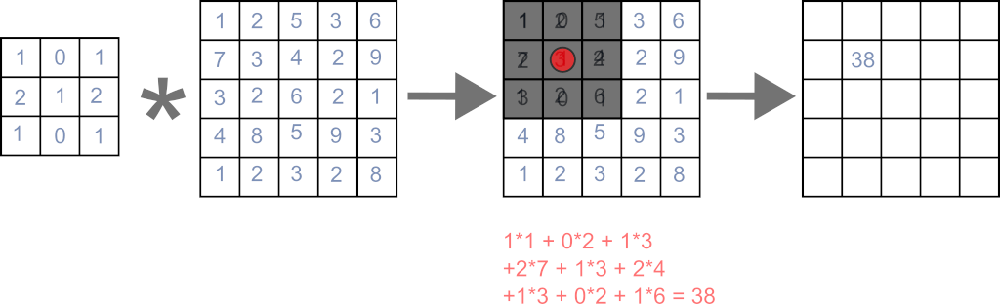

<!--
author:   sib

email:    

version:  0.0.1

language: en

script: 
        ./src/config.js
        https://cdn.plot.ly/plotly-2.12.1.min.js
        ./lib/jsmatrix_no_module.js
        https://cdn.jsdelivr.net/npm/chart.js
        ./src/main.js

comment: A small showcase of low-rank filter approximations

@mutate.remover

@end

-->

# Introduction

This document is a basic overview of how to (approximately) decompose a 2D convolution filter into multiple 1D filters.
This is by no means exhaustive and it is recommended to look at dedicated resources for more precise and detailed information.

## The definition of convolution

The definition of a discrete 2D convolution of two functions $\operatorname{f},\operatorname{g}$ is defined as follows:

$$
\begin{align*}
 (\operatorname{f} \ast \operatorname{g})[m,n]    &= \sum_{j=-\infty}^\infty\sum_{i=-\infty}^\infty \operatorname{f}[i,j]\operatorname{g}[m -i, n - j] \\
                    &= \sum_{j=-\infty}^\infty\sum_{i=-\infty}^\infty \operatorname{f}[m-i,n-j]\operatorname{g}[m -i, n - j] \\
                    &=  (\operatorname{g} \ast \operatorname{f})[m,n]
\end{align*}
$$

There are a lot of things to keep in mind when dealing with this and the actual application.

* There are $\infty$ bounds, but in an image processing application, your filters will be bounded. The functions are usually represented by a vector/matrix with an odd number of entries. The middle entry will be the origin, which defines a radius in each direction how far the filter extends. Thus, the infinite bounds can be replaced by this radius ($-r$ to $r$). This is no contradiction to the definition, since values outside of the vector/matrix elements are considered to be $0$.
* You have to be careful about indices. The definition presented comes from a signal processing context and is like that for a reason. Often times (such as in the next section) you will see a visual explanation of applying a filter to an image. Using that procedure corresponds to using a flipped filter in the above definition! So you need to be aware of when the "visual" version is used and when the actual definition of the convolution operation. *Note:* With symmetric filters this won't make a difference.
* The result of the convolution can be extended to any number, but, similar to the first point, we work with bounded images. In that case, the resulting image will just have the same size as the original one and we define what the values of the image outside of the bounds are, as the filter will access those elements. This can just be $0$ or some border value or different kinds of repetitions of the image.

## Visual explanation

In the previous section, the mathematical definition was presented. A more visual explanation is as follows:

- Create new image with the same as the old one
- Compute each pixel of the new image as follows

  - Overlay the pixel in the original image at the same position with the filter (the middle of the filter is located at that pixel)
  - Multiply each filter element with the pixel value which it overlays
  - Sum up all the products

In the image, the application of a filter to one pixel is shown.

The main caveat here is mentioned in the last section: This way the filter is flipped in both directions compared to the mathematical definition of a convolution, so keep that in mind.

## Separability

For simplicity, we will consider only square filters with a size of $k\times k$. 
Rectangular filters are the same but require more writing.
From the previous section, we can see that the computational complexity of applying a filter to a pixel is $k^2$.
This can be very expensive for larger filters.
In some cases, we might speed up this operation significantly using separability.
A 2D filter is separable, if we can represent it as the convolution of two 1D filters.
One of these 1D filters is applied vertically and one horizontally.
We can write this as:

$$
\begin{align*}
\operatorname{h}    &= \operatorname{u} \ast \operatorname{v}\\
                    &=  \begin{pmatrix}u_1 \\ \vdots \\ u_k\end{pmatrix} \ast \begin{pmatrix}v_1 & \dots & v_k \end{pmatrix}
\end{align*}
$$

If you are wondering how you would compute this convolution with the previous 2D definition, you can just pad out the vectors with zeros everywhere else.

$$
\begin{align*}
\begin{pmatrix}u_1 \\ \vdots \\ u_k\end{pmatrix} &\hat{=} 
    \begin{pmatrix}
        0 & \dots & u_1 & \dots & 0 \\
        \vdots & & \vdots & & \vdots \\
        0 & \dots & u_k & \dots & 0
    \end{pmatrix} \\
\begin{pmatrix}v_1 & \dots & v_k\end{pmatrix} &\hat{=} 
    \begin{pmatrix}
        0 & \dots & 0\\
        \vdots & & \vdots \\
        v_1 & \dots & v_k\\
        \vdots & & \vdots \\
        0 & \dots & 0
    \end{pmatrix}
\end{align*}
$$

If you apply the formula for the convolution to $\operatorname{u} \ast \operatorname{v}$ you will get the following:

$$
\begin{align*}
(\operatorname{u} \ast \operatorname{v})[m,n]   &= \sum_{j=-\infty}^\infty\sum_{i=-\infty}^\infty \operatorname{u}[i,j]\operatorname{v}[m -i, n - j]\\
                                                &= u_m v_n \\
 (\operatorname{u} \ast \operatorname{v}) &= \begin{pmatrix}
    u_1 v_1 & \dots & u_1 v_k \\
    \vdots & \ddots & \vdots \\
    u_k v_1 & \dots & u_k v_k
 \end{pmatrix}
\end{align*}
$$

This result may look familiar to you, as it is a common operation: The outer product of two vectors!
In the following, bold face will be used when the vector/matrix form is emphasized.

$$
\begin{align*}  
\mathbf{u} &= \begin{pmatrix}u_1 \\ \vdots \\ u_k\end{pmatrix} \\
\mathbf{v} &= \begin{pmatrix}v_1 \\ \vdots \\ v_k\end{pmatrix} \\
\mathbf{u} \mathbf{v}^T &= \begin{pmatrix}
    u_1 v_1 & \dots & u_1 v_k \\
    \vdots & \ddots & \vdots \\
    u_k v_1 & \dots & u_k v_k
 \end{pmatrix} \\
 &= (\operatorname{u} \ast \operatorname{v})
\end{align*}
$$

So, how does this help with complexity? 
If you plug in the zero-padded filters into the convolution formula, all terms aside from one in one of the sums will vanish (due to containing a multiplication with one of the zero terms). This reduces one of the summations to just one term, so overall we only have one summation left (which sum disappears, depends on whether you plug in the horizontal or vertical filter)!
We now have to do two consecutive convolutions instead of just using the full 2D filter, but each of these convolutions only has a complexity of $k$.
Thus the overall complexity is $2k$ instead of $k^2$ for the 2D filter.
This quickly becomes a huge difference, though keep in mind, that actual computation times are not that simply related to the complexity due to a lot of other factors.
Especially for large filters, this will still give a huge boost in speed.

An important, but simple example is a box-blur filter. 
This filter will just average all values in its influence window. 
Here you can see, how we can separate a $3\times 3$ box filter:

$$
\begin{align*}
    \frac{1}{9}\begin{pmatrix} 1 & 1 & 1 \\ 1 & 1 & 1 \\ 1 & 1 & 1 \end{pmatrix} &= (\frac{1}{3}\begin{pmatrix} 1  \\ 1 \\ 1 \end{pmatrix})(\frac{1}{3}\begin{pmatrix} 1 & 1 & 1 \end{pmatrix}) \\
    &= \frac{1}{9}\begin{pmatrix} 1  \\ 1 \\ 1 \end{pmatrix}\begin{pmatrix} 1 & 1 & 1 \end{pmatrix}
\end{align*}
$$

Another famous and very important filter is the Gaussian filter, which creates a nice and smooth blur.

The next section will show you a way to automatically find such a separation, if possible.
If there is no such thing, we can approximate it, which might still be faster than doing the 2D filter.

# Low-rank approximation

In the following, we will have a look at how to separate a filter using a singular value decomposition. 

After that, we can check out interactive examples of the process and the actual filtering.

## How to (approximately) separate a 2D filter

An incredibly powerful mathematical tool is the singular value decomposition (SVD).

We don't need to go into the details here, as there would be too much to cover.

A good overview can be found on Wikipedia: https://en.wikipedia.org/wiki/Singular_value_decomposition

For our purposes, we only need to know a few things.

Given a real matrix $\mathbf{M} \in \mathbb{R}^{m\times n}$, we can factorize it as:

$$
 \mathbf{M} = \mathbf{U}\boldsymbol{\Sigma}\mathbf{V}^T
$$

* The matrix $\mathbf{U} \in \mathbb{R}^{m\times m}$ contains the $m$ so-called left singular vectors $\mathbf{u}_i$ in its columns
* The matrix $\mathbf{V} \in \mathbb{R}^{n\times n}$ contains the $n$ so-called right singular vectors $\mathbf{v}_i$ in its columns
* The matrix $\boldsymbol{\Sigma} \in \mathbb{R}^{m\times n}$ contains the $\min(m,n)$ so-called singular values $\sigma_i$ on its diagonal and is $0$ otherwise. The singular values are sorted in decreasing order.

Most math/linear algebra programming libraries/tools will have a way to compute the SVD.
Just keep in mind, that sometimes, the matrices will have slightly different sizes, for example, to save space. For that same reason, we will assume here, that $m \geq n$, it just makes things easier to write and it only matters for writing down the entries in the matrix, the final step is independent of that.

Now, with some mechanical manipulation of the two matrix multiplications in $ \mathbf{U}\boldsymbol{\Sigma}\mathbf{V}^T$ we can find an alternative way to write it (it is still the same result!). A diagonal matrix multiplied on the left just scales the rows with their corresponding diagonal entry.
In this case, the rows of $\mathbf{V}^T$ are just the right singular vectors $\mathbf{v}_i$. 

$$
    \boldsymbol{\Sigma}\mathbf{V}^T = \begin{pmatrix}\sigma_1 \mathbf{v}_1^T \\ \vdots \\ \sigma_n \mathbf{v}_n^T \\ \mathbf{0}\end{pmatrix}
$$

A general matrix product can be written as the sum of the outer products of the left matrix's columns and the right matrix's rows. This gives us:

$$
    \mathbf{U}\boldsymbol{\Sigma}\mathbf{V}^T = \sum_{i=1}^{\min(m,n)} \sigma_i\mathbf{u}_i\mathbf{v}_i^T
$$

Another important fact about the SVD is, that the number of non-zero singular values is the rank of the matrix.
So, for example, assume, that our matrix $\mathbf{M}$ has rank $1$. That means, only the first singular value is non-zero, leaving us with the following expression:

$$
\begin{align*}
\mathbf{M} &= \mathbf{U}\boldsymbol{\Sigma}\mathbf{V}^T \\
&= \sum_{i=1}^{\min(m,n)} \sigma_i\mathbf{u}_i\mathbf{v}_i^T \\
&= \sigma_1\mathbf{u}_1\mathbf{v}_1^T
\end{align*}
$$

We only have one outer product (with a scaling factor) left! That is exactly what we have seen in the section on separability! 

This means that a 2D filter is separable, if its rank is $1$. In that case the two 1D filter kernels are the left and right singular vectors. The scaling factor $\sigma_1$ can either be multiplied onto one of the two vectors, or we could split it up as $ (\sqrt{\sigma_1}\mathbf{u}_1)(\sqrt{\sigma_1}\mathbf{v}_1^T)$.

Below you can try out the algorithm for a Gaussian filter. The bottom row and the left column show the two first singular vectors scaled by $\sqrt{\sigma_1}$.
The only additional step is that it is checked, whether the elements with the maximum absolute value in the singular vectors have a negative sign.
If both of these elements are negative, both vectors are negated.
Multiplying by $(-1)*(-1)$ does of course not change the formula above, so nothing is changed.
This is just to display the values better.

@mutate.remover(gaussianSVD)

If you clicked on the button to show the approximation, you have probably noticed, that nothing changed. This is because the 2D Gaussian has rank $1$ and can be exactly reconstructed with just the first singular value and vectors.
The other interesting part is, that, the two 1D filters look like Gaussians themselves. This is of course expected, as the 2D Gaussian is constructed by the convolution of 1D Gaussians.

This is not all, though! Even if the 2D filter has a rank greater than $1$, we can approximate it using the sum of outer products! We can just choose a certain maximum number of terms for our approximation. When we choose all non-zero singular values, we will exactly get our filter back (minus numerical inaccuracies).

This is due to the fact, that convolution is a linear operator, so we have $(a\operatorname{f} + b\operatorname{g}) \ast \operatorname{h} = a(\operatorname{f} \ast \operatorname{h}) + b(\operatorname{g} \ast \operatorname{h})$. Thus, if we apply our filter $\mathbf{M}$ to an image $\mathbf{I}$, we have:

$$
\begin{align*}
    \mathbf{M} \ast \mathbf{I} &= ( \mathbf{U}\boldsymbol{\Sigma}\mathbf{V}^T )\ast \mathbf{I}   \\
    &= (\sum_{i=1}^{\min(m,n)} \sigma_i\mathbf{u}_i\mathbf{v}_i^T)\ast \mathbf{I} \\
    &= (\sum_{i=1}^{\min(m,n)} \sigma_i(\mathbf{u}_i \ast \mathbf{v}_i))\ast \mathbf{I} \\
    &= (\sum_{i=1}^{\min(m,n)} \sigma_i(\mathbf{u}_i \ast \mathbf{v}_i \ast \mathbf{I}))
\end{align*} 
$$

If we choose a maximum rank of $l \leq \min(m,n, \operatorname{rank}(M))$, then the complexity of this operation will be $2lk$, when the original filter had a size of $k \times k$. Depending on the constants involved, this might still be a lot better than $k^2$. If we have a close to separable filter, then most of the information will be in first $2$ or so singular values, with each successive one becoming a lot smaller.

The next section has an interactive showcase of different filters and their reconstructions of adjustable rank.

## Interactive visualization of the approximation

Below is a visualization of the low-rank filter approximation of a number of different filters. 
You can adjust the maximum rank that is used for the reconstruction and see both the reconstruction and the error. 
The singular values are plotted as well, so you can compare the change in the approximation with regard to the singular values.
You can see that the separable filters will have only one zero singular value.

@mutate.remover(lowRankApprox)

## Filtering with the approximation

Below you can see the actual application of the low-rank application as an actual image filter. 
You can change the approximation rank and also change the image.
In most cases, you probably won't be able to tell a difference when only using one or two approximation steps.

@mutate.remover(filterlowRank)

